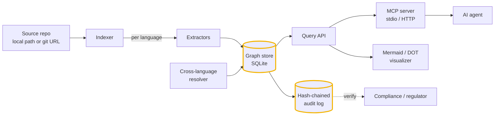
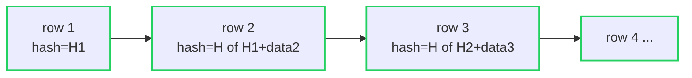
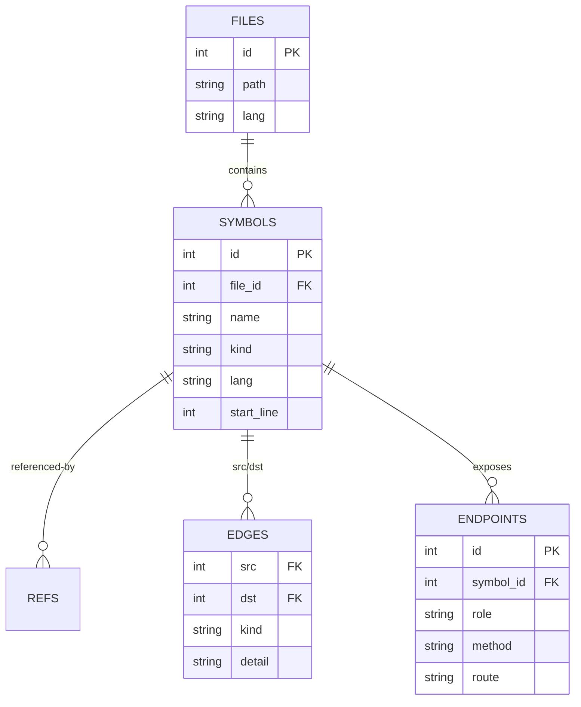

# Architecture

`codegraph-mcp` turns a repository into a queryable, provable knowledge graph and
serves it to AI agents over MCP. This document explains how the pieces fit
together, end to end.

## The pipeline

## Components

### Indexer (`codegraph/indexer.py`)
Walks a path (or clones a git URL read-only) and dispatches each file to a
language extractor. Supports **full** indexing (`index_path`, `index_git`) and
**incremental** indexing (`index_incremental`) that re-parses only the files
changed since a base ref — the mode you wire into CI so the graph stays current
on every push.

### Extractors (`codegraph/extractors/`)
Each language contributes symbols (functions, methods, classes, types with exact
locations), call edges, references, and HTTP endpoints (client `fetch`/route
declarations and server route handlers). A Python-native extractor handles
Python via the `ast` module; a fast regex extractor covers TypeScript,
JavaScript, Go, Rust, Java, and C#. Adding a language means adding one extractor.

### Cross-language resolver (`codegraph/crosslang.py`)
The differentiator. Client calls like `fetch('/api/users/:id')` and server route
declarations are normalized to a canonical `METHOD /path/<param>` shape, then
joined across files that **share no symbol name**. The result is a
`cross_lang_http` edge linking a TypeScript caller to the Go/Python/Java/C#/Rust
handler that actually serves it.

### Graph store (`codegraph/graph.py`)
A single SQLite database (`files`, `symbols`, `refs`, `edges`, `endpoints`,
`audit`, `tokens`). It answers `search`, `refs`, `callers`, `callees`, `impact`
(transitive blast radius), `xlang`, `orphans` (dead-code candidates), `hotspots`
(most depended-on), and `project-graph` (the module-level map).

### Audit log (`codegraph/audit.py`)
Every read and admin action is appended to a hash-chained log: each row's hash
covers the previous row's hash, so any later edit breaks the chain. `verify()`
replays it and reports the first broken sequence. This is what makes "which
agent read what, and when" a provable fact rather than a guess.

### Tokens (`codegraph/tokens.py`)
Scoped bearer tokens (`read`, `write`, `admin`) for agents. Only the token hash
is stored; the secret is shown once at issue time. The MCP server authorizes
each tool call against the token's scopes and logs denials.

### MCP server (`codegraph/mcp_server.py`, `http_server.py`)
Serves the graph to agents as MCP tools over stdio or HTTP. Each tool call is
authorized, executed against the store, and recorded in the audit log with a
compact result fingerprint.

### Visualizer (`codegraph/viz.py`)
Renders the `project` (architecture) and `impact` (blast radius) views as Mermaid
or Graphviz DOT, so the graph lives in your README, wiki, or a generated SVG.

## Data model

## Why these choices

- **SQLite, no server.** The graph is a file you can copy, diff, and ship. No
  daemon to operate, no data leaving your machine.
- **On-prem, no training.** Your code is never sent to a vendor or used to train
  a model. The graph is built locally and served locally.
- **Provable by construction.** The audit chain is not a feature bolted on; it is
  the path every read takes.
